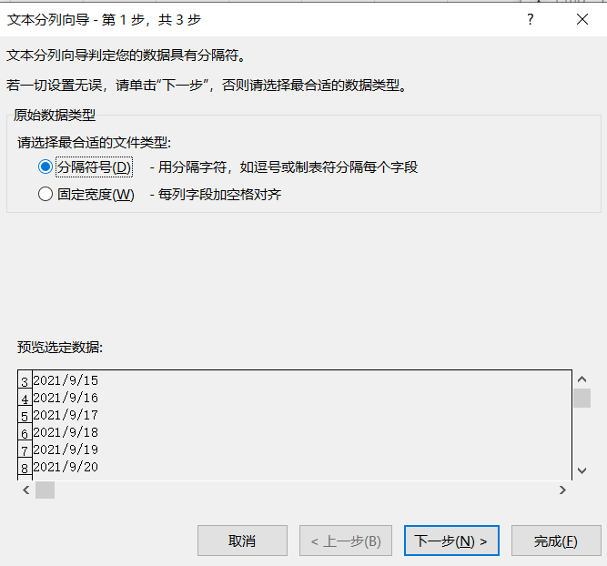
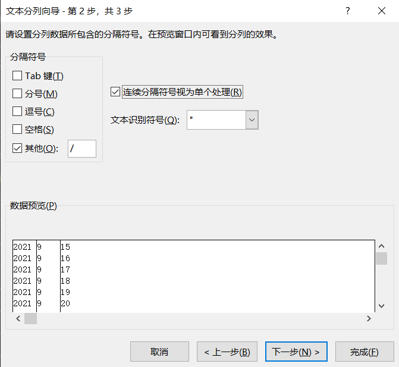
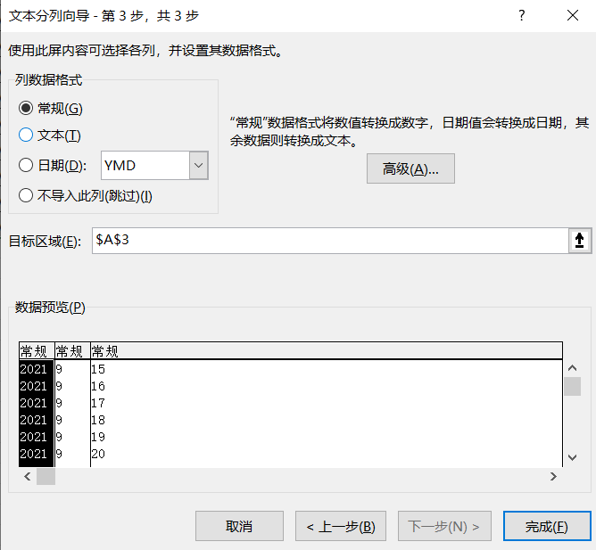

## Excel浅入

_来自 Datawhale free-excel 组队学习 chapter1_

1.了解老版本xls和新版本的xls区别，新版本的excel功能更加强大并且丰富
2.每一个excel工作簿都里都由sheet组成，每一个sheet其实就是一张独立的表
3.打开不太常见的数据，比如txt、csv格式(虽然搞数据分析还是蛮常见的）获取数据导入加载，然后加载的excel表会自动链接外部源文件，当然也可以取消，如果不想刷新恢复原数据的会。
4.Excel数据格式还是蛮重要的，一些函数对数据格式有要求。
真数字右对齐，假数字左对齐（文本型数字）
日期也有真假日期，真日期能相减得到天数差，假日期无法这么操作
一般都是通过调整单元格格式进行数据类型转换，教程中使用文本分列向导的方法还是第一次见，可以深入学习用法。

### 文本分列

#### 分隔符号

如果读者熟悉split，这个功能类似于Python里对string字符串的split操作

比如对上面的2021/9/15这种Y/M/D日期类的数据，我们可以使用分隔符号`/`来进行分割

这里有将连续分隔符视作单个处理的选项

然后在最后确认完成的页面，我们可以对分割后的数据进行预览和最后的调整，包括对列数据格式的调整等。

#### 固定宽度

这个方式我理解为手动划分

如果分割符不规则或者很复杂，就可以采取这种方式
